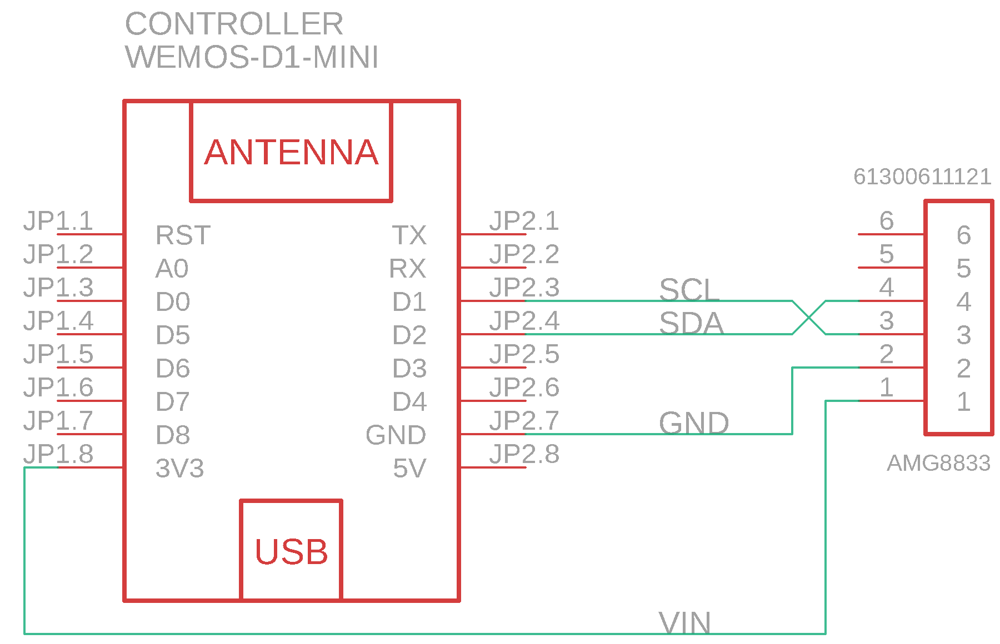

# ESP8266 AMG8833

Source code for creating firmware for an ESP8266 chip (d1 mini in my case) to use an AMG8833 sensor with https://github.com/TheRealWaldo/thermal

## Parts

[AMG8833](https://industry.panasonic.eu/components/sensors/industrial-sensors/grid-eye/amg88xx-high-performance-type/amg8833-amg8833) - I used one on a breakout board for quick prototyping from [AliExpress](https://www.aliexpress.com/item/1005001585288156.html?spm=a2g0s.9042311.0.0.27424c4dmuBfsJ).

[D1 Mini](https://www.wemos.cc/en/latest/d1/d1_mini.html) - There is quite a few variants of this, but I had some laying around from [Banggood](https://www.banggood.com/Geekcreit-D1-Mini-V3_0_0-WIFI-Internet-Of-Things-Development-Board-Based-ESP8266-4MB-MicroPython-Nodemcu-p-1264245.html?cur_warehouse=CN&ID=522225).
## Wiring

## Building

This project uses [PlatformIO](https://platformio.org/) to simplify development.  The easiest way to get started is to install [VSCode](https://code.visualstudio.com/) and the [PlatformIO VSCode plugin](https://marketplace.visualstudio.com/items?itemName=platformio.platformio-ide) (simple instructions [here](https://platformio.org/install/ide?install=vscode)).

Once you have opened this project, building and uploading the project to your ESP8266 board is as easy as clicking on the Build and Upload buttons.

## Configuring

Once you have have built and uploaded the firmware, a captive portal (WiFi Network) will start called `thermalvision`.  If you do not see it, try a double reset on the board.  

Connect to that network, and an interface to configure the WiFi Network you wish to connect to will appear.

Once connected, it will use DHCP to find it's IP address.  You can either refer to your DHCP server to identify the IP of the board, or refer to the Serial Monitor which will output the current IP.  We highly recommend you register the MAC address of your board with your DHCP server and give it a static IP.

Next, follow the instructions at https://github.com/TheRealWaldo/thermal to connect Home Assistant to your new Thermal Vision camera!

